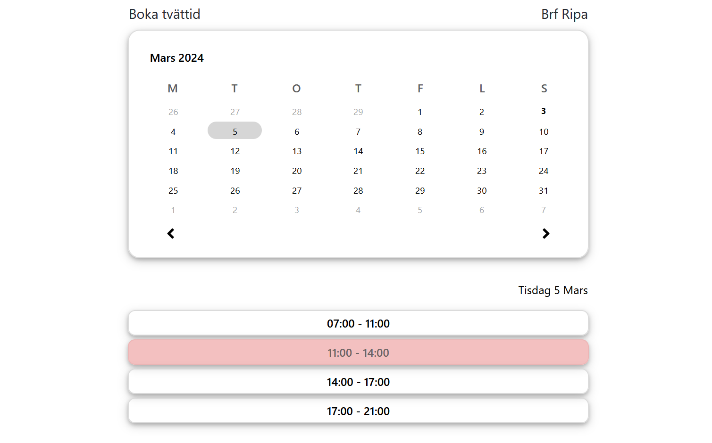

# Calendar Booking App

## Overview

This repository contains a web-based calendar booking app that enables users to reserve time slots in a common calendar. The application is developed using React for the frontend and Node.js for the backend.

## Features

- **Intuitive Interface:** User-friendly design for easy navigation.
- **Date Selection:** Utilize a calendar component for seamless date picking.
- **Real-time Updates:** Book time slots with immediate visual feedback.
- **Technologies:** Built with React and Node.js.

## Technologies Used

- **Frontend:** React
- **Backend:** Node.js

## Setup Instructions

1. **Clone the Repository:**
    git clone https://github.com/gustavAlbrekts0n/bokningsapp.git

2. **Install Dependencies:**
    cd bokningsapp
    npm install

3. **Run the Application (Windows only):**
    ./startScript.bat

4. **Access the Application:**
    Open your browser and visit `localhost:8080` to access the app.
